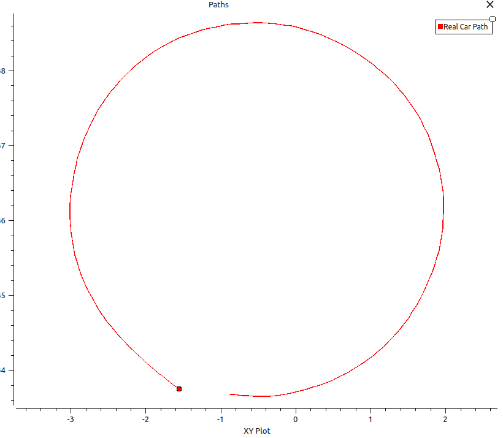
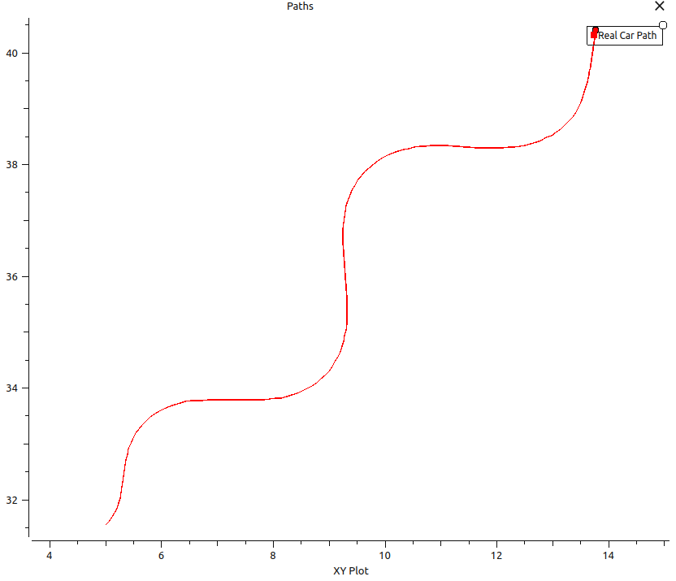
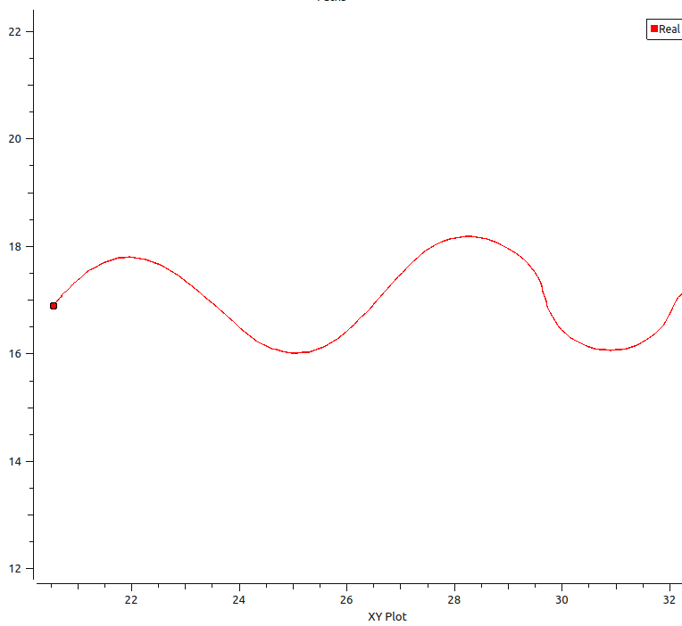
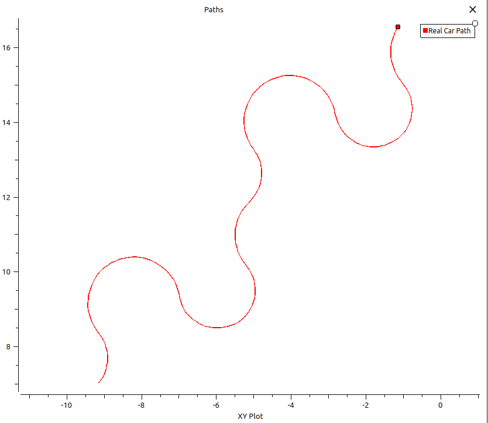
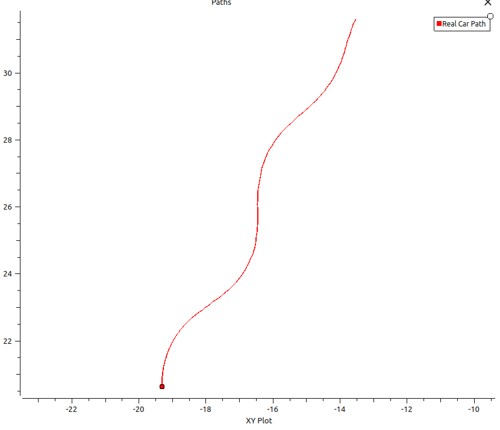
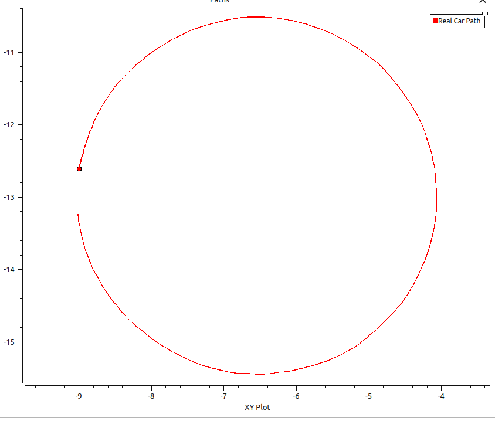
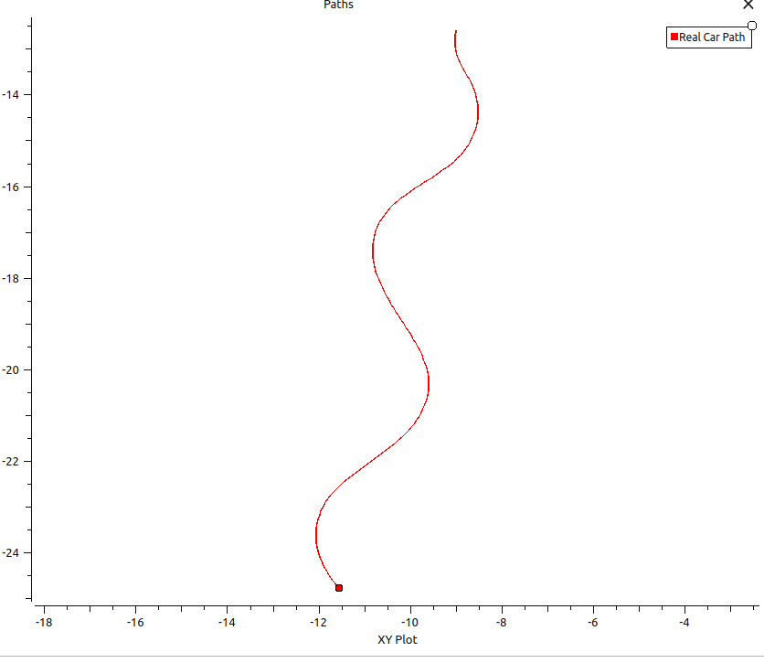
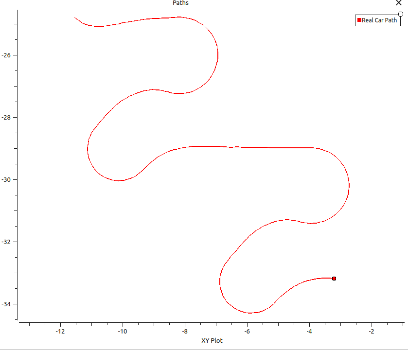
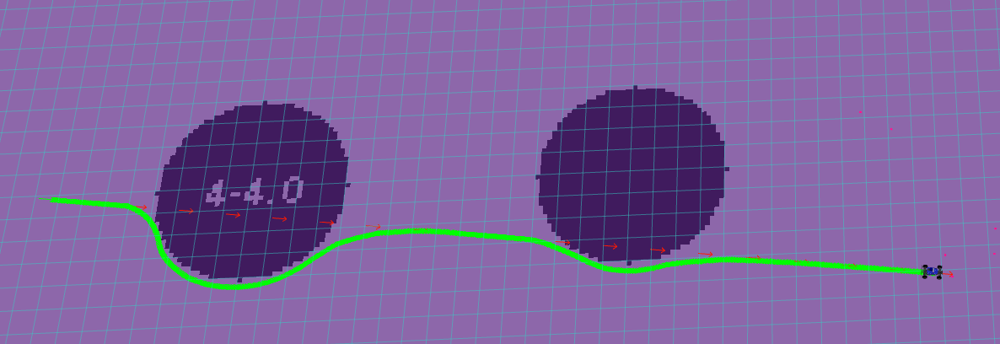
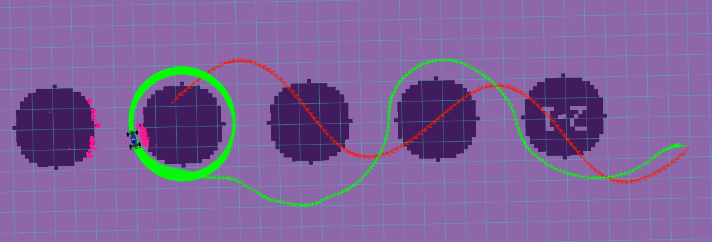

# Project 3: Control

## Deliverables

### 1. What tradeoffs did varying the Kp gain have on your PD controller's performance?

Increasing Kp made the controller respond more aggressively to cross-track error. This helped the car correct back toward the path faster, but if Kp was too high it also made the controller more oscillatory and caused overshoot, especially on curved paths. Increasing Kd added damping, which reduced oscillation and helped smooth out the response, but if Kd was too large the controller became too sluggish and under-corrected. In general, the tradeoff was between responsiveness and stability — larger Kp improved correction speed, while larger Kd improved damping, but too much of either hurt the tracking quality in different ways.

### 2. Describe the tuning process for your PD controller. Justify your final gains Kp, Kd and include the controller plots for three reference paths on the default sandbox map (pid_circle.png, pid_left.png, pid_wave.png).

We tuned the PD controller by starting from the provided baseline values Kp = 0.5 and Kd = 0.5 and then observing the controller behavior on multiple reference paths. With the higher starting gains, the controller was too aggressive, especially on curved paths, and this showed up as oscillation and overshoot. We then reduced the gains and compared the tracking behavior again. Lowering both gains to Kp = 0.3 and Kd = 0.3 produced a smoother response and reduced the unwanted oscillation while still allowing the car to follow the required paths successfully. We chose these as the final gains because they gave the best overall compromise between stability and path tracking performance across the circle, left-turn, and wave paths.

| Circle | Left Turn | Wave |
|--------|-----------|------|
|  |  |  |

### 3. Describe the lookahead distance tuning process for your Pure Pursuit controller. Justify your final lookahead distance by including the controller plot for the wave reference path on the default sandbox map (pp_wave.png).

We tuned the Pure Pursuit controller by varying the lookahead distance and comparing the tracking behavior on the required paths. When the lookahead distance was too small, the controller became too reactive and produced oscillatory behavior because it chased points too close to the current vehicle position. As we increased the lookahead distance, the tracking became smoother and more stable, but if the lookahead became too large the controller began smoothing out the path too much and performed worse on tighter turns like left-turn. We found that a lookahead distance of 1.0 gave the best compromise across both the wave path and the left-turn path. It tracked the wave path smoothly while still handling turns better than larger lookahead values.

### 4. Include controller plots on the wave path for cases where the lookahead distance is too small/large (pp_small.png, pp_large.png). Explain the resulting Pure Pursuit behavior.

When the lookahead distance is too small, the Pure Pursuit controller selects reference points very close to the current vehicle position, making it highly reactive to small variations in the path. This causes the controller to oscillate around the path, especially on curved sections, because it is constantly over-correcting to chase nearby waypoints. The resulting behavior is jittery and unstable, with the car frequently crossing back and forth over the reference path.

When the lookahead distance is too large, the Pure Pursuit controller selects reference points far ahead on the path, which smooths out the response but at the cost of cutting corners. On curved paths like the wave, the controller fails to follow the curve accurately because it is aiming at a point far ahead, causing it to drive straight through turns. The resulting behavior is smooth but systematically deviates from the reference path on curves.

### 5. How does varying the radius of the circle path affect the robustness of the Pure Pursuit controller?

Larger circle radii are easier for the Pure Pursuit controller to track because they correspond to softer curvature. With a large radius, the controller can follow the path more smoothly and with less tracking error. Smaller circle radii are less robust because they require sharper turning, and Pure Pursuit's geometric lookahead can smooth out the turn if the lookahead distance is too large relative to the circle radius. In our case, this caused the controller to cut the corner and follow a larger-radius circle than the reference circle. A smaller lookahead can help Pure Pursuit handle tighter turns, but if it is too small the controller becomes more reactive and oscillatory. In other words, Pure Pursuit is generally more robust on wide, gradual curves than on very tight turns.

### 6. Describe the tuning process for the MPC optimization parameters. Justify your final parameters K, T by including the controller plots for the circle, wave, and saw reference paths on the default sandbox map. What makes the saw path so difficult to track?

We tuned MPC by starting with the default parameters (K=8, T=15, distance_lookahead=1) and observing tracking performance on the circle, wave, and saw paths. With K=8, the 8 sampled steering angles provided adequate coverage of the steering range to find good control actions without being too computationally expensive. We found that T=15 produced a long enough prediction horizon for the controller to anticipate upcoming turns and avoid obstacles, but was still short enough that the controller could react quickly to new information. Increasing K further (e.g., K=16) gave marginally better path coverage but at the cost of doubling the computation per control cycle, which caused the controller to lag at 50Hz. Decreasing T (e.g., T=8) made the controller too short-sighted and it struggled to navigate around obstacles in the slalom world. We settled on K=8 and T=15 as the best balance between planning horizon, steering resolution, and computational efficiency.

| Circle | Wave | Saw |
|--------|------|-----|
|  |  |  |

The saw path is the most difficult to track because of its sharp directional changes. Unlike the smooth curvature of the circle and wave paths, the saw path has abrupt corners where the reference heading changes instantaneously. MPC's finite horizon means it must commit to a steering angle before reaching the corner, and the discrete sampling of steering angles may not include the exact angle needed to execute the sharp turn precisely. Additionally, the car's kinematic constraints prevent it from instantaneously changing direction, so it will inevitably cut the corners slightly.

### 7. Include controller plots for two reference paths and slaloms of your choice in the slalom_world map.

We tested the line and wave paths in the slalom_world map. MPC successfully avoided the obstacles while tracking each reference path, demonstrating the advantage of the collision cost term in the optimization.

| Slalom 1 | Slalom 2 |
|----------|----------|
|  |  |

### 8. In this project, we asked you to implement a very specific MPC cost function that only includes distance and collision terms (and specific weights for the two terms). What other terms might you include, if you were to customize your cost function?

Several additional cost terms could improve MPC performance in practice. A **smoothness cost** penalizing large changes in steering angle between consecutive timesteps would reduce jerky control and improve ride comfort. A **speed tracking cost** penalizing deviation from the reference speed would help the car maintain consistent velocity. A **proximity cost** that increases smoothly as the car approaches obstacles (rather than the binary collision check) would produce more graceful avoidance behavior. Finally, a **curvature matching cost** encouraging the rollout curvature to match the path curvature could improve tracking on winding roads.

### 9. Include a bag file and a screenshot of rviz for the MPC running on the real car with `rosrun control path_sender circle --tf_prefix "car/" --speed 1.0 --radius 1` and `rosrun control path_sender wave --tf_prefix "car/" --speed 0.5`.

### 10. Include a bag file and a screenshot of rviz for each controller (pid, pp and mpc) running on the real car.

