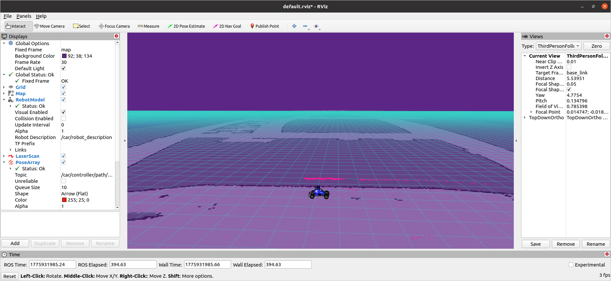
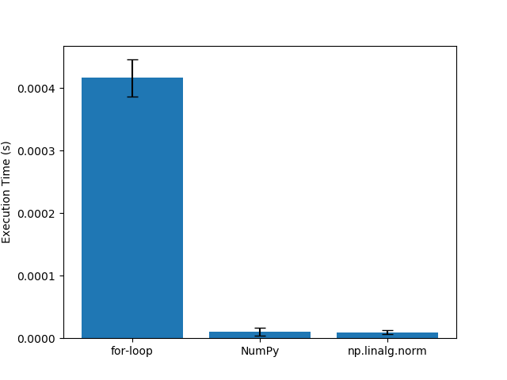
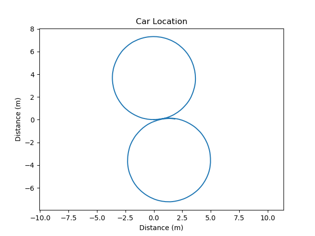
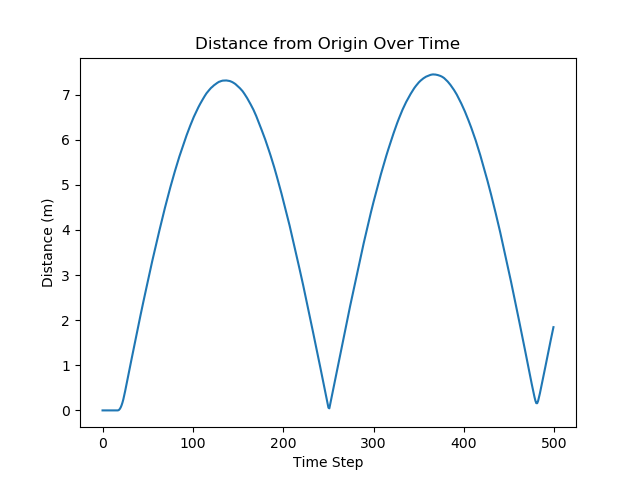
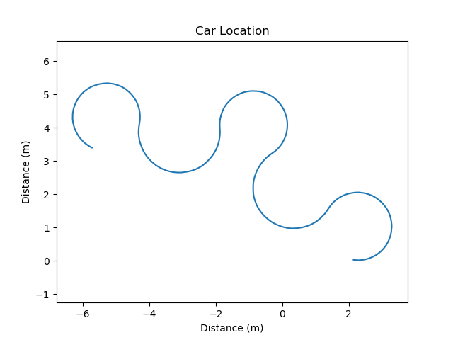
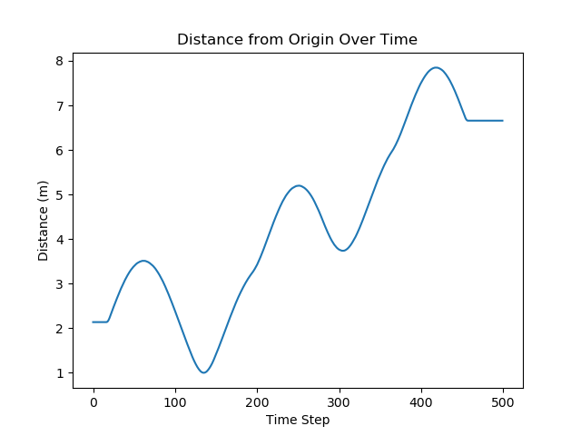

# Project 1: Introduction 

Define in your own words what a node, topic, publisher, and subscriber are and how they relate to each other.

Node: processes that communicate amongst each other so the MuSHR system can easily use custom software and ROS components simultaneously.
Topic: a communications specialist that sends information between nodes and allows us to view those messages.
Publisher: a message writer that creates the messages to be sent and used.
Subscriber: a message receiver that reads and uses messages relevant to its task. 

How they relate to each other: They work together to communicate in some way to power the ROS framework.

What is the purpose of a launch file?
A launch file explains to the computer how to start the software components. 

Include the RViz screenshot showing the new map.

Include your runtime_comparison.png figure for the different norm implementations.

Include the locations.png and distances.png figures for the plan figure_8.txt.

Include the locations.png and distances.png figures for the plan tight_figure_8.txt.

