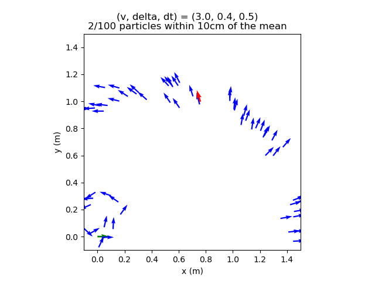
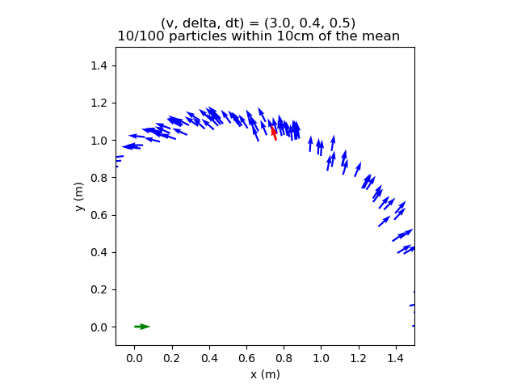
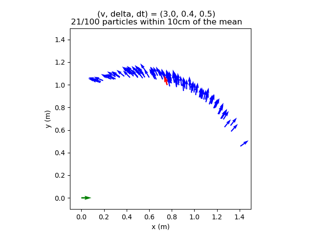
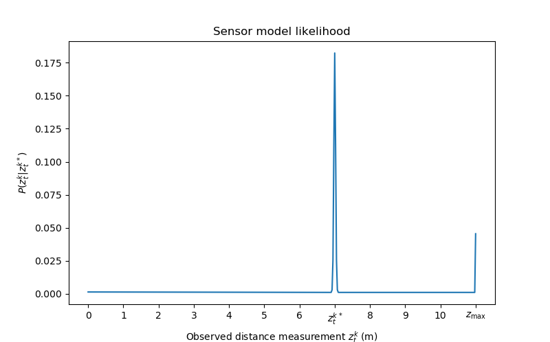
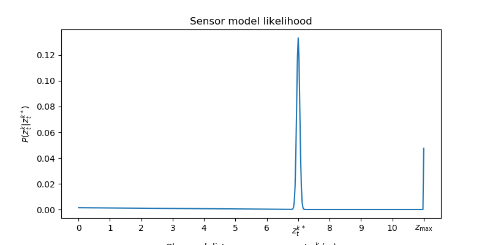
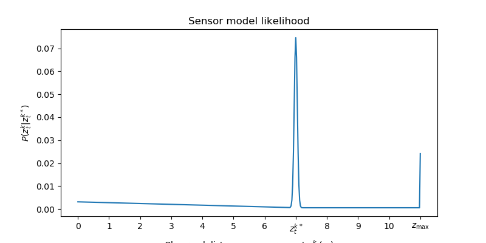
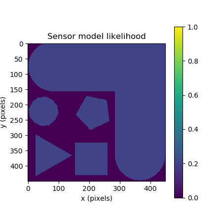
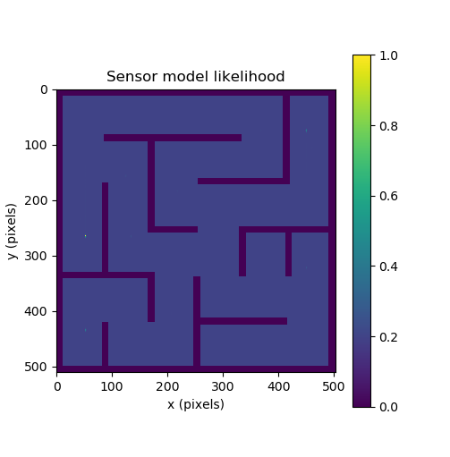
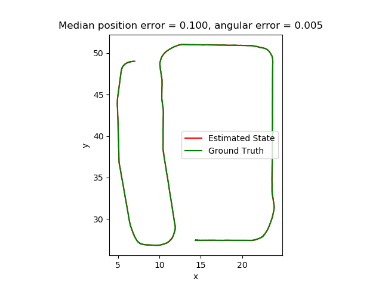

# Project 2: Localization 

In the motion model plot, why are there more particles within a 10cm radius of the noise-free model prediction in Figure 2 than Figure 3?

1: Figure 2 has more particles within 10 cm of the noise-free prediction because the given motion in example_cases is much smaller. The velocity and timestep are both lower, so the vehicle travels a shorter distance and accumulates less uncertainty. In Figure 3, the vehicle moves faster, for longer, and turns more, so both control noise and model noise spread the particles farther from the deterministic next state. As a result, fewer particles remain within 10 cm of the noise-free prediction.

Include mm1.png, mm2.png, and mm3.png, your three intermediate motion model plots for control 
. Use them to explain your motion model parameter tuning process. For each plot, explain how it differs from Figure 3, and how you changed the parameters in response to those differences. The last plot should reflect your final tuned parameters.

2: 
Initial motion paramaters-

Loaded parameters: {'vel_std': 0.05, 'delta_std': 0.5, 'x_std': 0.05, 'y_std': 0.05, 'theta_std': 0.05}. 
Compared to Figure 3 in the spec, this plot was much too spread out, with only 2/100 particles within 10 cm of the mean. Since the particles were too spread out, I concluded that the parameters were too noisy, so I needed to lower their standard deviation values.

Second tuning attempt-

Loaded parameters: {'vel_std': 0.03, 'delta_std': 0.2, 'x_std': 0.02, 'y_std': 0.02, 'theta_std': 0.02}
This produced a better result. The particles were still spread along the expected curved banana-shaped trajectory, but the distribution was more concentrated and looked closer to Figure 3, with 10/100 particles within 10 cm of the mean. This was an improvement, but it was still more dispersed than the reference plot, so I reduced the noise parameters further.

Final tuning attempt-

Loaded parameters: {'vel_std': 0.03, 'delta_std': 0.1, 'x_std': 0.01, 'y_std': 0.01, 'theta_std': 0.01}
This plot matched Figure 3. The particle distribution had the same banana-shaped spread as the reference plot, and 21/100 particles were within 10 cm of the mean, matching the reference figure. Lowering the steering angle noise and the state noise made the particles cluster more tightly around the expected curved motion while still preserving the overall spread expected from the motion model.

What are the drawbacks of the sensor model’s conditional independence assumption? How does this implementation mitigate those drawbacks? (Hint: we discussed this in class, but you can look at LaserScanSensorModelROS for the details.)

3: 
The drawback of the conditional independence assumption is that it treats each LIDAR beam like it is independent from the others once the pose and map are fixed. In reality, that is not really true because nearby beams often hit the same wall or object, so they are related. That can make the filter too confident if it treats a bunch of very similar beams as separate evidence.

This implementation helps with that by not using every single laser beam. It downsamples the scan, so there is less repeated correlated information. It also squashes the particle weights after applying the sensor model so the filter does not become too overconfident from one scan.

Include sm1.png, sm2.png, and sm3.png, your three intermediate conditional probability plots for 
. Document the sensor model parameters for each plot and explain the visual differences between them.

4:
Initial sensor paramaters-

sensor_params:
  hit_std:    1.0
  z_hit:      0.5
  z_short:    0.05
  z_max:      0.05
  z_rand:     0.5

explenation: With the initial parameters, the plot is dominated by a very tall narrow peak at the expected measurement and a smaller spike at z_max. There is not much visible probability mass to the left of the expected measurement, so the short reading part is not very noticeable yet. This made the model look very concentrated around the expected distance.

Second tuning attempt-

sensor_params:
  hit_std:    2.0
  z_hit:      0.7
  z_short:    0.2
  z_max:      0.05
  z_rand:     0.1

explenation: For this version, The increased hit_std  made the main peak around the expected measurement wider and less sharp. We also increased z_short, so there was more probability on the left side of the plot for readings shorter than expected. Lowering z_rand reduced the flat background. Compared to sm1, this plot is less dominated by one sharp spike and gives a little more mass to short readings.

Final tuning attempt-

sensor_params:
  hit_std:    2.0
  z_hit:      0.77
  z_short:    0.75
  z_max:      0.05
  z_rand:     0.5

explenation: For the final version, W kept hit_std the same so the peak stayed wider than in the original plot, but W increased z_short a lot so the short reading side of the curve became more visible. This redistributed more probability mass to measurements below the expected one. The spike at z_max stayed present, and the plot overall looked less like a single narrow spike and more like a mixture of the different sensor model cases as in the lecture slides.

# Results for tunning on the map for figures 4 and 5.

Figure 4

Figure 5

Include your tuned sensor model likelihood plot for the robot positioned at state (-9.6, 0.0, -2.5) in the maze_0 map.

5: 

6: 

