# Project 4: Planning 

Include the A* shortest path figure on map2.txt between (252, 115) and (350, 350), with 600 vertices and a connection radius of 100.

## 1:
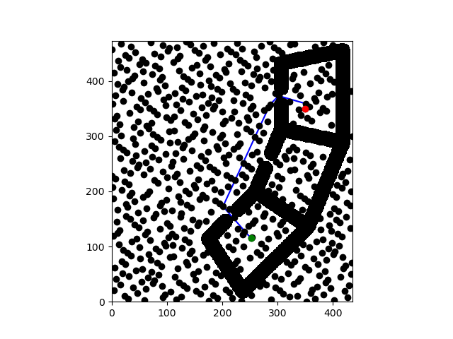

Holding the number of vertices constant at 600, vary the connection radius when computing the shortest path on map2.txt. For each experiment, report the radius, path length, and planning time. Explain any variation. (You may find a table useful for summarizing your findings.)

## 2:

| Trial | Radius | Path length | Planning time | Explanation |
|---|---:|---:|---:|---|
| 1 | 60 | N/A | N/A | When the connection radius is reduced to 60, A* fails to find a path because the roadmap becomes too sparse. The start and goal are not connected through a collision free sequence of edges, so node 601 is not reachable from node 600. This suggests that below about 65, the radius is too small to maintain connectivity in the roadmap on map2.txt |
| 2 | 100 | 362.8869 | 0.7447 | At radius 100, A* finds a shortest path because the roadmap is connected enough for the start and goal to be linked through collision free edges. |
| 3 | 200 | 362.8867 | 2.8505 | At radius 200, A* still finds a shortest path, but planning takes longer. The larger radius creates many more edges in the roadmap, so A* has more graph structure to search through even though the final path length is almost the same as at radius 100. |

Holding the connection radius constant at 100, vary the number of vertices when computing the shortest path on map2.txt. For each experiment, report the number of vertices, path length, and planning time. Explain any variation. (You may find a table useful for summarizing your findings.)

## 3:
| Trial | Vertices | Path length | Planning time | Explanation |
|---|---:|---:|---:|---|
| 1 | 600 | 362.8869 | 0.6811 | At 600 vertices, A* finds a shortest path because the roadmap is dense enough to connect the start and goal through collision free edges. |
| 2 | 575 | 362.8869 | 0.6254 | At 575 vertices, A* still finds the same shortest path, but the planning time is slightly lower because the roadmap contains fewer vertices and edges to search.|
| 3 | 550 | 362.8869 | 0.5691 | At 550 vertices, A* still finds the same shortest path and the planning time decreases slightly again. This suggests the roadmap is still sufficiently connected even with fewer sampled vertices. |
| 4 | 540 | N/A | N/A | At 540 vertices, A* fails to find a path. Based on testing nearby values, the transition between 541 and 540 vertices appears to be the point where the roadmap becomes too sparse for the fixed radius of 100 to maintain connectivity between the start and goal. |

For your choice of number of vertices and connection radius, compute the shortest path on map2.txt with A* and with Lazy A*. Report the path length, planning time, and edges evaluated, and explain any variation. python3 scripts/run_search -m test/share/map2.txt -n <N> -r <R> [--lazy] r2 -s 252 115 -g 350 350

## 4:
| Search | Vertices | Radius | Path length | Planning time | Edges Evaluated | Explanation |
|---|---:|---:|---:|---:|---:|---|
| A* | 600 | 100 | 362.8869 | 0.7358 | 23016 | Standard A* searches a roadmap whose edges were already collision-checked during construction. This means the search runs on a fully validated graph, but more work is done up front when building the roadmap. |
| lazy A* | 600 | 100 | 362.8869 | 0.1057 | 833 | Lazy A* delays collision checking until edges are actually needed during search. In this experiment, it found the same path length as standard A* while taking much less planning time and evaluating only 833 edges, compared to 23016 for A*. This shows that lazy collision checking avoided a large amount of unnecessry edge evaluation in this roadmap.|

Compare the time spent on planning and shortcutting on map1.txt. Describe qualitatively how the paths differ.

## 5: 
Shortcutting took much less time than planning in this test because it operates on an already computed path instead of searching the full roadmap graph. The original Lazy A* path followed the roadmap vertices more closely and therefore contained extra intermediate turns and waypoints. After shortcutting, the path became shorter and more direct because collision free connections were added between no -adjacent path vertices, removing unnecessary middle vertices.

Holding the number of vertices and connection radius constant at 40 and 4 respectively, vary the curvature at 3, 4.5, 9, and 15 when computing the shortest path on map1.txt. Include plots of the computed paths for each curvature. Describe qualitatively how the paths differ, and quantitatively compare the path lengths.

## 6: 

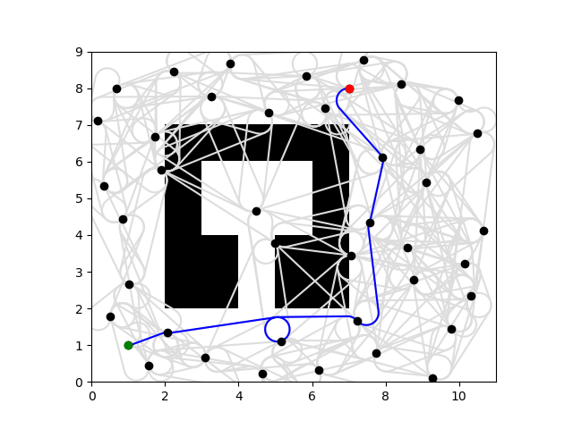

Path Length: 16.0869 

Curvature: 3

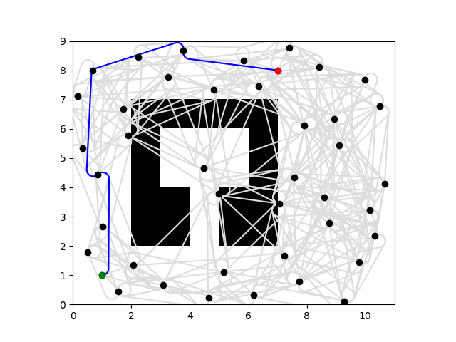 

Path Length: 14.7731 

Curvature: 4.5

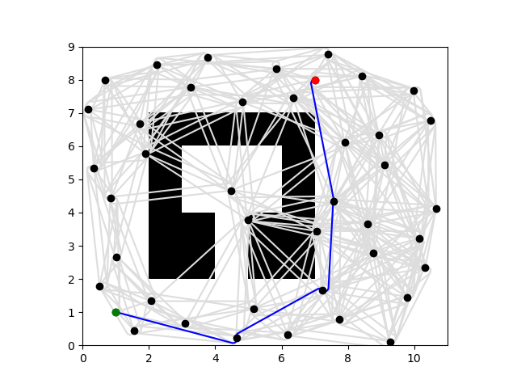 

Path Length: 13.6062

Curvature: 9

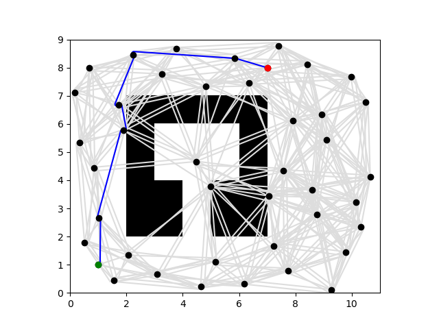

Path Length: 13.206

Curvature: 15

Explenation: 

As curvature increased, the computed paths became tighter and more direct because the Dubins car was allowed to turn more sharply. At lower curvature values, the planner had to use wider arcs, which made the path longer and more constrained by the car’s turning radius. Quantitatively, the path length consistently decreased as curvature increased, dropping from 16.0869 at curvature 3 to 13.2060 at curvature 15. The shortest path occurred at curvature 15, which makes sense because greater allowable curvature gives the vehicle more flexibility to reach the goal efficiently.

## 7

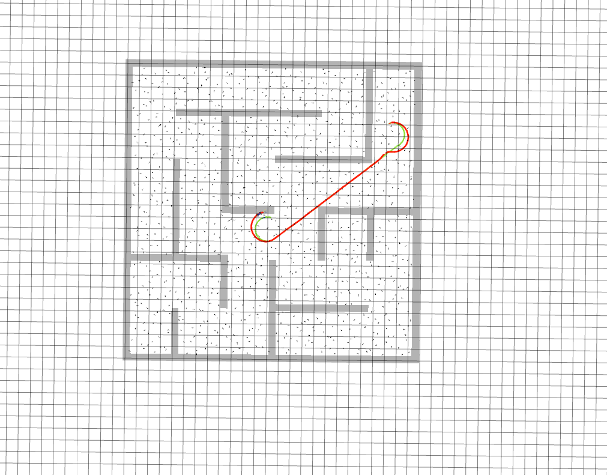

## 8

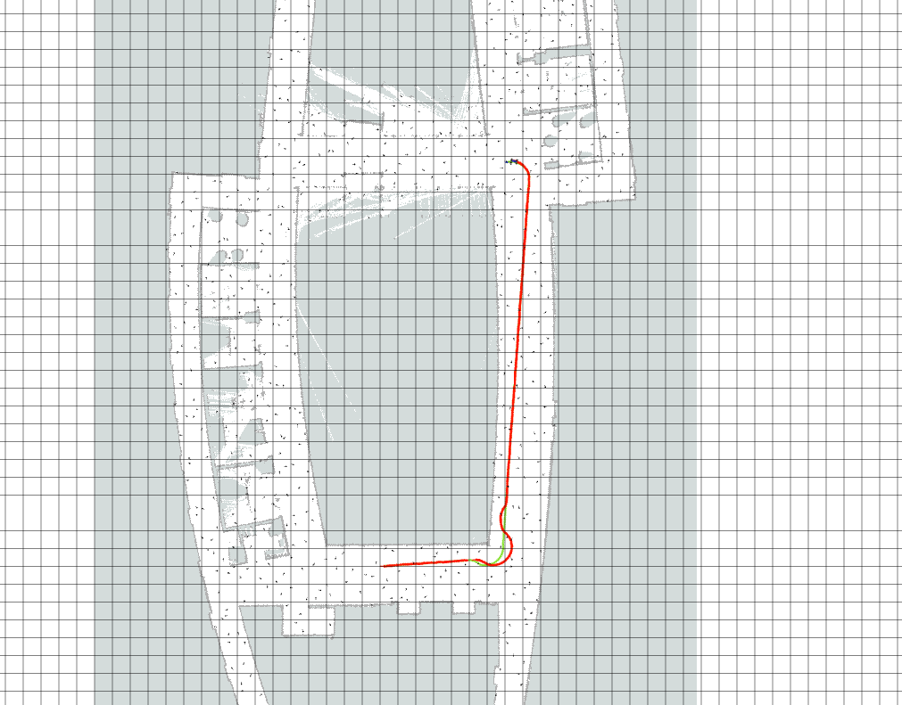

num_vertices:=1500 connection_radius:=10 curvature:=1

## 9

RRT has two key parameters: `eta` (step size toward sampled node) and `bias` (probability of sampling the goal directly). Defaults: `eta=0.5, bias=0.05`.

**Bias** — Higher bias pulls the tree toward the goal faster. At bias=0.2 the path converged in 25 edges (vs 98 at 0.05). Bias=0.4–0.75 was fastest (~27–30 edges). Bias=0.9 over-sampled the goal, wasting iterations extending from distant nodes (97 edges). Sweet spot: 0.2–0.4.

**Eta** — Small eta (0.15–0.25) takes cautious steps, needing ~270+ edges and ~0.4s. Large eta (0.75–1.0) converges in 17–35 edges (~0.01s) but produces longer, coarser paths. Sweet spot: ~0.5.

**Max iter** — On this map the planner always converged by iteration 98, so values beyond 100 had no effect. In harder environments, a conservative max_iter (2500–5000) prevents returning an empty array if the tree needs more exploration.

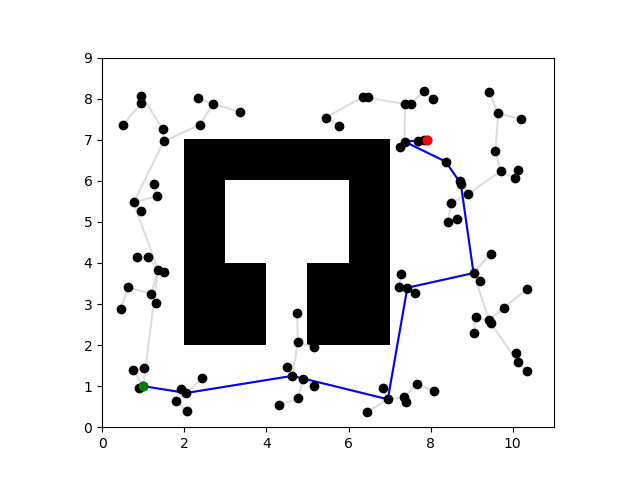
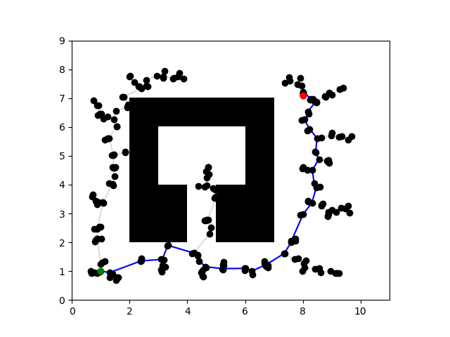
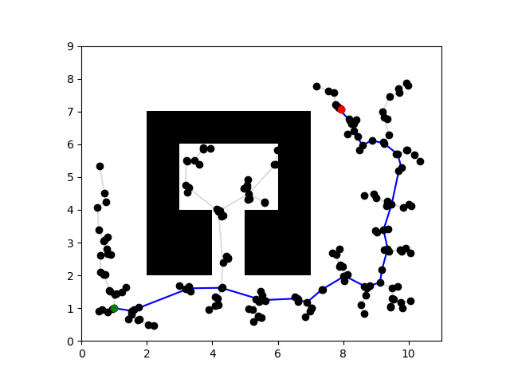
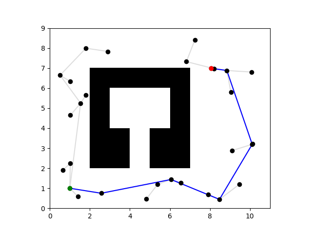
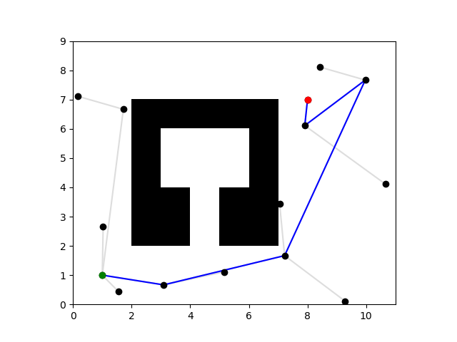
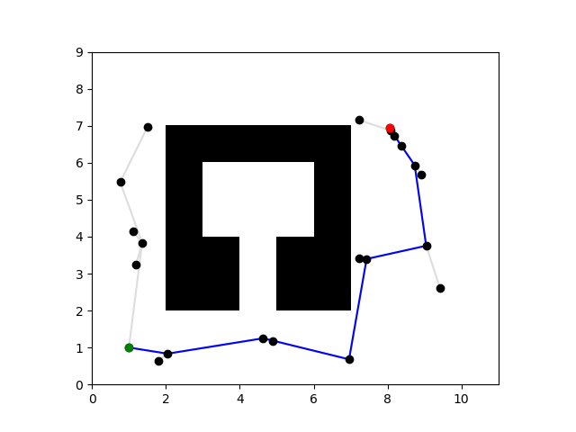

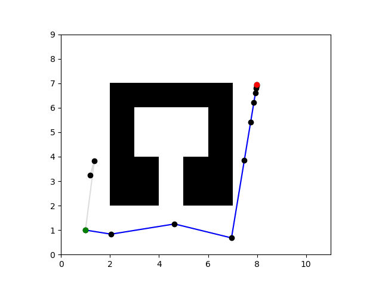

